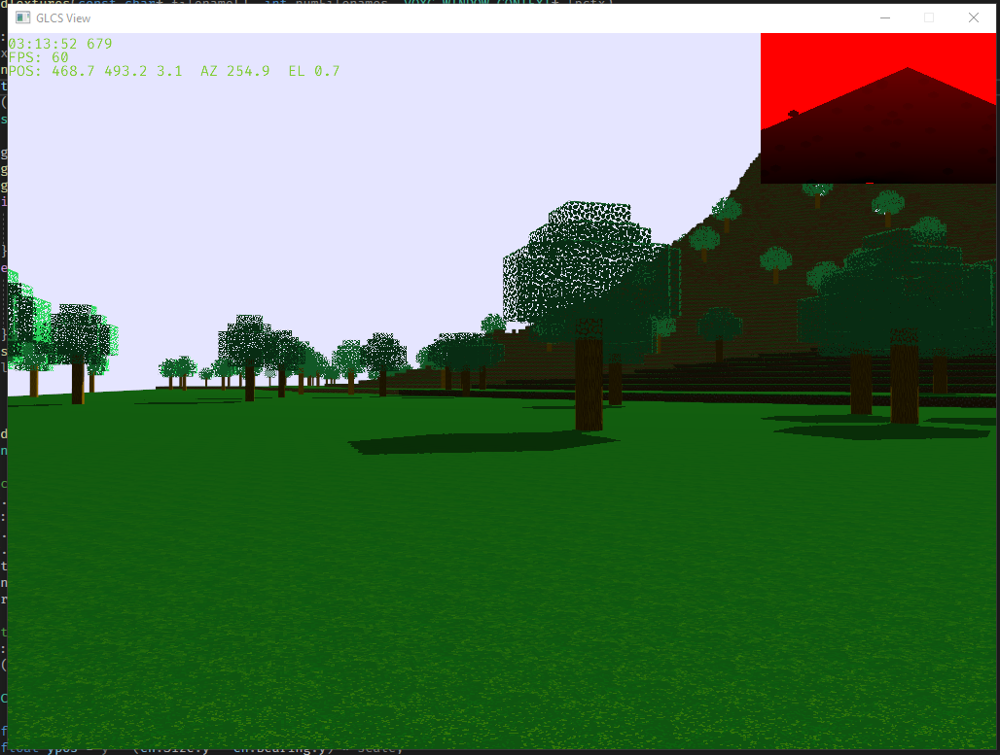

# VulkanBoxes
My first foray into Vulkan.  What else are you gonna do during a pandemic?  

This contains code from the Vulkan Tutorial by Alexander Overvoorde, April 2020.

Stuart Harlan
11/13/2020

So...this changed to OpenGL 4.6.  It's morphed into a cubic voxel-based world. The Vulkan code is still there but there is a new OpenGL-based implementation.

12/11/2020

